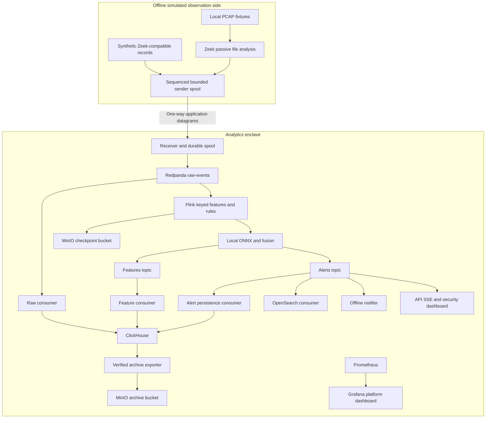

# SIH26145 implementation handoff

## Objective and current status

Build a restart-resilient, offline simulation of passive OT network threat detection using the supplied Redpanda/Flink/ClickHouse architecture. Both directions of observed conversations are available. The system detects incrementally, explains alerts and never probes observed endpoints or decrypts application payloads.

This repository is presently a scaffold with requirements and research. No services, trained artifacts, tests, Compose configuration or benchmarks have been implemented. Empty directories indicate intended ownership, not delivered capability. This plan is the entry point for the implementing agent.

Read `AGENTS.md`, `docs/decisions.md`, `docs/contracts.md` and `docs/ml-research.md`. The user has delegated routine technical choices and has not selected hardware. Do not block implementation on GPU availability, a particular log schema, internet access at runtime, or a pre-existing dataset. Begin with documented fixtures and CPU-only operation.

## Architecture to implement



The datagram link has no application ACK/NACK or source-query protocol. Sequence gaps and duplicates are expected failure cases, not evidence of exactly-once transfer. Receiver-to-Redpanda uses ordinary acknowledged Kafka traffic entirely within SOC. Sender buffering cannot react to receiver congestion across a true one-way link; bound it and report known loss/gaps. Do not claim Docker simulates physical isolation against a compromised host.

There is no SOC-triggered PCAP retrieval across the boundary. Any PCAP movement is a preconfigured autonomous outward export; the SOC retrieves only already-exported files. Default fixture playback needs no full-PCAP archive transfer.

## Folder structure

```text
.
├── AGENTS.md
├── README.md
├── IMPLEMENTATION_PLAN.md
├── docs/
│   ├── decisions.md
│   ├── contracts.md
│   ├── ml-research.md
│   ├── architecture.md              # create before application code
│   ├── threat-model.md              # assets, boundaries, attacks, mitigations
│   ├── feature-catalog.md
│   ├── failure-model.md
│   ├── deployment.md
│   ├── demo.md
│   └── status.md                    # measured evidence and open limitations
├── architecture/                    # Mermaid sources / exported diagrams
├── schemas/                         # versioned JSON Schema and examples
├── sensor/zeek/                     # scripts, log policy, Dockerfile
├── ingest/sender/                   # tailing, rotation, sequence, spool, replay
├── ingest/receiver/                 # datagram validation, spool, Kafka publisher
├── flink/                          # Maven Java project
│   └── src/{main,test}/java/
├── models/{dga,dns_tunnel,beacon,encrypted,ddos,scan,exfiltration}/
├── model-training/                 # pinned Python training/export/evaluation
├── backend/                        # authenticated REST/SSE and static UI serving
├── dashboard-security/             # React/TypeScript source
├── dashboard-platform/             # provisioned Grafana JSON dashboards
├── consumers/{clickhouse,opensearch,notifier,archive}/
├── infra/{redpanda,clickhouse,opensearch,prometheus,grafana,minio}/
├── docker/                         # Dockerfiles and profile overrides
├── data/{fixtures,manifests}/       # small fixtures and labels; no downloaded corpus
├── data-generator/                 # deterministic file-based scenarios
├── tests/{unit,schema,integration,e2e,failure}/
├── benchmarks/{scenarios,results}/
├── scripts/                        # doctor, demo, bundle, restore and test entrypoints
├── docker-compose.yml              # implement; does not exist yet
├── .env.example                    # configuration names only; no real secrets
└── .gitignore
```

## Runtime and offline packaging

Use the candidates in `docs/decisions.md`, then pin the actual successful dependency set. Verify native ONNX operation on the chosen container architecture before building detectors around it. Preserve a CPU-only path. Record OS, CPU, RAM, container resource limits, versions and fixture/model hashes in each benchmark.

Default runtime: one Redpanda broker, Flink JobManager and TaskManager, ClickHouse, MinIO, independent consumer pipelines, API/UI, Prometheus and Grafana. Sender/receiver and Zeek replay belong to the simulation profile. Combine static UI serving with the API; do not add an extra dashboard web-server container without need. Connect can host independent pipelines, but failures must not couple their acknowledgements. OpenSearch is implemented under `search`; Suricata is optional. Avoid adding Redis, Kubernetes, a Python inference service or a heavyweight registry merely to complete a technology list.

Produce profiles `demo`, `search`, and `production-like`; document whether `demo` is selected via configuration or explicit profile commands. Plain `docker compose up -d` must start the default core runtime after documented provisioning and artifact loading. Plain `docker compose down` must preserve named volumes; never use `down -v` in routine scripts. Add service health checks, readiness dependencies and restart policies. Restart policies alone do not resubmit a lost Flink job.

The Flink job must have automatic lifecycle supervision: prefer a tested application deployment or an idempotent supervisor that detects an existing job, submits when absent, and restores from supported durable recovery metadata. Do not rely on an operator manually pasting a checkpoint path after every restart. Stable job/operator identities, checkpoint storage and configured HA recovery must be tested together. Distinguish task failure, coordinator restart and complete Compose restart.

Air-gap delivery is two-stage:

1. On a connected build machine, resolve dependencies, build application images, train/export the model, generate fixtures, run validation and vulnerability scans, then export all runtime images/artifacts with checksums and an SBOM.
2. On the offline target, verify/load the bundle, provision local credentials, run environment checks and start Compose with no registry pulls, package downloads, external fonts, CDNs, telemetry, live DNS enrichment or internet identity dependency.

Provide `scripts/build-offline-bundle.sh`, `scripts/load-offline-bundle.sh` and `scripts/doctor.sh`. Docker Engine/Compose and adequate disk/RAM are prerequisites, not services this repository silently installs. Clearly state if connected build or native compilation cannot be completed in the agent's environment.

## Latency and throughput contract

Primary throughput unit: accepted canonical events/second. Also report offered, valid, invalid, processed, dropped and persisted rates; replay flow count and PCAP packet/byte rates are separately labelled. Never convert JSON byte throughput into observed network Mbps.

Time points: capture event, sensor emit, receiver arrival, broker acknowledgement, detector eligibility, alert publication, API arrival and browser render. Synchronize clocks within the demo and use monotonic timing for local spans. A replay has original event time plus replay wall time; preserve both.

Normal-load acceptance targets:

- Receiver-to-visible-alert latency after sufficient evidence: p50 <1 s, p90 <2 s, p95 <3 s, p99 <5 s.
- Report maximum and number/fraction of samples above 5 s. A run cannot claim a universal 5-second bound if any qualifying sample exceeds it.
- If a non-browser harness is used, call its measurement API-visible latency, not rendered-dashboard latency.
- Report attack-onset-to-alert separately, including sensor emission and evidence accumulation. Beaconing may need minutes; time-window detectors cannot promise detection before evidence exists.
- Overload and outage periods are measured separately and never removed silently from headline measurements. Recovery delay is not a normal-load guarantee.

Start trial workloads at 100/500/1000 events/s only to establish capacity. Tune LOW/MEDIUM/HIGH to measured hardware; STRESS ramps beyond sustainable throughput. Warm up JVM/models, run a steady interval of at least 10 minutes, repeat trials, and include mixed benign/attack and high-cardinality traffic. Use an open-loop offered load so congestion is not hidden by a producer waiting for each response. Record CPU, memory, disk, network, backlog, inference and checkpoint health. Declare the sustainable rate only after latency, loss and bounded-backlog criteria pass.

## Phases and gates

### Phase 0 — freeze design and inspect environment

Create `docs/architecture.md`, `docs/threat-model.md`, `docs/failure-model.md` and `docs/status.md`. Cover all requested views: executive/detailed data flow, trust boundaries, ML, feature/state, Flink, broker, storage, dashboards, observability, deployment and hardening. Record an environment inventory and a compatibility smoke test for Java/Flink/Kafka/ONNX. Keep diagrams consistent with implementation. No active security scan of external or observed networks.

Gate: explicit assumptions, tested build/runtime candidate and a measurable acceptance checklist. If runtime tools are absent, proceed with code/tests that can run, but mark runtime gates blocked rather than claiming completion.

### Phase 1 — schemas and fixtures

Create event, feature, alert and model JSON Schemas from `docs/contracts.md`, including allowed enums, max lengths, numeric bounds and schema evolution policy. Build valid/invalid/missing/unknown examples. Create a feature catalog with formula, unit, key/window, missingness and model-use definitions. JSON Schema is chosen for readable Zeek/demo integration; a later Avro migration requires evidence and compatibility planning.

Gate: schema tests reject malformed/incompatible records; meaningful zero remains distinct from missing; train/runtime feature order has a golden contract.

### Phase 2 — ingestion and reproducible simulation

Implement seeded synthetic-log generation with ground truth in sidecar manifests. Include benign industrial polling and maintenance. Independently implement PCAP fixtures and Zeek file processing so the real sensor path is exercised. Never label synthetic records as Zeek-processed captures. Default generator writes local files; no packet transmission is required.

Configure JSON logs and bounded early/periodic telemetry. Tail safely across rename/rotation and persist offsets. Sender sequence and spool records survive restart. Receiver validates envelopes, writes a durable bounded spool, publishes to Redpanda and tracks sequence gaps, duplicates and spool pressure. Ensure oversize datagrams are rejected or use an explicitly bounded fragmentation/reassembly design; do not rely on arbitrary UDP fragmentation for large JSON records.

Gate: a PCAP produces validated events through the receiving publisher into Redpanda; restart and rotation do not silently skip records; injected transport loss is visible.

### Phase 3 — Flink vertical slice

Implement KafkaSource, normalization, watermarking, keyed state, feature extraction and KafkaSink using Java DataStream. First deliver a scan/rate rule and deterministic feature output. Set operator UIDs, bounded timers/collections, state cleanup, durable checkpoints and controlled restart policies. Start with aligned checkpoints and a short measured interval; use RocksDB if state/resource tests justify it. Evaluate unaligned checkpoints only when backpressure evidence warrants their additional I/O/state cost.

Use checkpointed consistent state with at-least-once alert output and durable consumer deduplication initially. Document replay duplicates and test them. Do not confuse exactly-once state with exactly-once external side effects. Keep sink persistence entirely outside the detector job.

Gate: raw events create live rule alerts before replay ends; TaskManager failure recovers and preserves detector state; state growth remains bounded under high key cardinality.

### Phase 4 — real ML and remaining detectors

Train a compact DGA logistic model with deterministic seeds and versioned preprocessing. Prefer locally available or prepared public DGA/benign data; if only synthetic algorithm families are available, label the model explicitly as simulation-trained. Separate generator seeds, families, hosts/scenarios and time where applicable across splits. Ground-truth labels, scenario IDs and attack-specific addresses must not leak into features.

Export to ONNX, compare Java and Python scores on golden vectors, measure inference, validate artifact checksum/schema, warm up and expose health. Test missing/corrupt model and rollback. Implement the seven threat classes using the selection matrix; not every class requires a learned model. Do not create dummy ONNX files. Evaluate calibration and incident-level performance honestly, including false positives on benign OT polling/backups.

Gate: one real trained ONNX model runs inside Flink, multiple rule/statistical detectors function, model failure preserves eligible rules, and required seven-class coverage has meaningful scenario tests.

### Phase 5 — incident lifecycle and notification

Implement bounded evidence retention, deterministic incident/update IDs, correlation, cooldown, suppression and severity escalation. Confidence needs a stated meaning and calibration status. Maintain append-only evidence and update history. Provide an offline notifier that records delivered notifications durably. External delivery is optional and must not configure remediation.

Gate: repeated suspicious DNS queries correlate into a bounded incident/update stream; stronger evidence escalates; replay does not duplicate the same notification update.

### Phase 6 — persistence, search and archive

Implement independent raw/features/alerts ClickHouse consumers, topic definitions, SQL migrations and batching. Implement OpenSearch mapping and an independent alert consumer using deterministic document/update semantics. Poison records have bounded retries and quarantine; transient storage errors retain offsets for retry.

Archive early enough to verify before 90-day hot expiration. Write immutable objects, manifests, checksums and source ranges; reconcile counts and test restoration. Do not install an unconditional destructive TTL and assume an exporter will beat it. Choose tested archive-eligibility tracking/conditional deletion or a documented retention hold procedure that prevents unarchived deletion. Alert on archive backlog and disk exhaustion. The demo may use accelerated age fixtures to test lifecycle behavior, without changing the documented production retention intent.

Gate: each storage outage leaves detection operating until its explicit broker/spool limit; recovery catches up without silent loss; unarchived data survives retention tests.

### Phase 7 — two dashboards

Implement a minimal authenticated SOC UI with live alert stream, severity totals, alert rate, latency percentiles, threat/confidence distributions and searchable incident details. Show evidence, feature values, model/detector version, source/destination, related records and timeline. Label uncalibrated scores and unavailable fields. No invented detection accuracy without ground truth.

Serve compiled static UI from the API. Use SSE with bounded client queues and reconnect/resume IDs; disconnect or resynchronize slow clients without backpressuring detection. API historical reads use databases while live alerts consume their own broker group. Show stale/unavailable history honestly during database outages.

Provision Grafana separately for platform metrics. Do not rebuild Grafana in the SOC UI.

Gate: live browser alerts appear while replay is running; role checks and escaped event rendering pass; dashboard/API outages do not stop Flink.

### Phase 8 — observability and health

Expose ingestion, processing, invalid/dropped/gap counts; alert counts; extraction/inference/processing histograms; model errors; consumer lag; checkpoints/backpressure; storage inserts; spool/disk pressure; CPU/RAM/network; and component health. Avoid per-IP or per-alert Prometheus labels. Aggregate histogram buckets across workers correctly before computing percentiles.

Export OT-side health outward rather than scraping backward across the simulated boundary. Distinguish alive, ready and degraded: missing optional model can mean ready with rules-only detection, while a stalled source requires visible degraded status. Readiness checks must not call observed endpoints. Use structured logs with correlation IDs; add sampled tracing only where it helps locate latency.

Gate: failure injections visibly change real metrics and dashboard state, including absent/stale telemetry.

### Phase 9 — restart, fault and load verification

Implement the required scenario matrix: benign, SYN flood, UDP amplification, spoofed-source-like flood, beaconing, DGA, DNS tunnelling, encrypted-malware-like metadata, scanning, exfiltration, mixed traffic, malformed input, missing fields, missing/corrupt model, ClickHouse failure, broker restart and Flink restart. Add archive failure, checkpoint storage outage, OpenSearch/notifier/API outage and disk/spool pressure.

For each test define offered ground truth, observable features, expected detector/abstention, latency start point, deduplication outcome and recovery expectations. Do not assert actual spoofing or malware solely from a synthetic label; state what the detector can observe.

Gate: publish commands, environment, seeds, raw machine-readable results and summaries. An automated run must prove Compose down/up without volume deletion resumes durable data/state and operational detection. Test coordinator recovery independently from worker recovery.

### Phase 10 — hardening and final handoff

Use non-root/read-only containers where compatible, dropped capabilities, scoped writable paths, mounted secrets, authentication/roles, audit logs, TLS and minimal exposed ports. Provision credentials locally; no production passwords or shared committed defaults. Pin digests/dependencies; generate SBOM and vulnerability scan reports in the build stage. Document any exception and licensing constraint.

Implement production-like replication and recovery as a separate profile after the laptop path works. Document multi-host Kubernetes mapping without claiming single-host HA. Produce a concise demo guide proving streaming, passive simulation, no decryption, explanations, model fallback, restart recovery and measured throughput/latency. Include `docker compose up -d`, `down`, `restart`, `logs` and `ps` instructions.

Gate: a clean offline machine with stated prerequisites can load the bundle, provision credentials, start the runtime, run a known scenario, observe alerts, restart and recover using only repository documentation.

## Suggested work packages

These are boundaries for the user's chosen implementing agent(s), not a request to start agents now.

| Work package | Owned paths | Dependency |
|---|---|---|
| Integration owner | contracts, Compose, pins, scripts, status | Freezes shared interfaces and integrates all work |
| Sensor/ingestion | sensor, ingest, data-generator, fixtures | Event schema |
| Detection/ML | flink, model-training, models, feature catalog | Event/feature/model contracts |
| Storage/API/UI | consumers, backend, dashboard-security, storage schemas | Alert/incident contracts |
| Platform/verification | monitoring configs, dashboard-platform, fault/load tests | Running vertical slice and metrics contract |

Do not have multiple agents independently redesign schemas or edit the same Compose file. If work is delegated later, use bounded ownership and integrate milestone by milestone.

## Completion checklist

- [ ] Architecture/threat/failure documents describe the implemented system.
- [ ] Strict schema validation and missingness semantics work.
- [ ] Real Zeek PCAP path and separately labelled synthetic path work.
- [ ] Redpanda and a real Java Flink job run under Compose.
- [ ] Seven threat classes have supported detectors and coverage/abstention tests.
- [ ] A real trained model runs through ONNX Runtime Java with parity evidence.
- [ ] Model versioning, corruption handling, rules fallback and rollback work.
- [ ] Incident evidence, deduplication and escalation work across replay/restart.
- [ ] ClickHouse persistence and optional-profile OpenSearch integration work.
- [ ] Archive verification, retention safety and restore work.
- [ ] Security dashboard and Grafana platform dashboard use real data.
- [ ] Prometheus metrics, auth, authorization and health checks work.
- [ ] Worker, coordinator, broker and full-runtime restart tests pass.
- [ ] Failure isolation is demonstrated with finite retention limits documented.
- [ ] Throughput and latency are measured on declared hardware.
- [ ] Offline bundle and clean-machine instructions are verified.
- [ ] No secrets are committed; no active production traffic or payload decryption exists.
- [ ] Simulation and single-host limitations are stated in UI/demo documentation.

## Prompt for the implementing agent

Read AGENTS.md and IMPLEMENTATION_PLAN.md in this repository, then implement the plan. The user has confirmed an offline simulation with bidirectional observed conversations, no active probing or return commands, CPU-only-compatible local inference, restart resilience, and a target of 3–5 seconds after sufficient evidence. Choose reasonable documented defaults where hardware/data are unavailable. Start by checking the environment, freezing schemas and validating the Flink/Kafka/ONNX dependency combination, then build a working Zeek-to-Redpanda-to-Flink-to-alert vertical slice. Continue through the milestone gates, tests, dashboards, offline packaging and measured benchmarks. Do not substitute Python for Flink, invent results, or claim production HA/physical diode enforcement. Track real completion evidence and unresolved limitations in docs/status.md.
