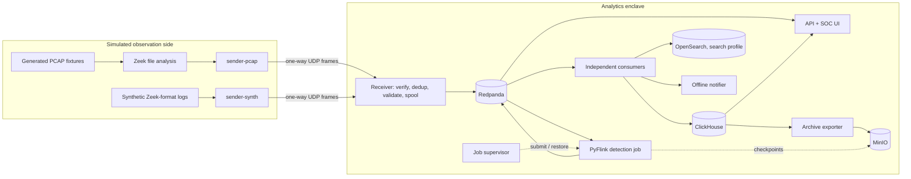
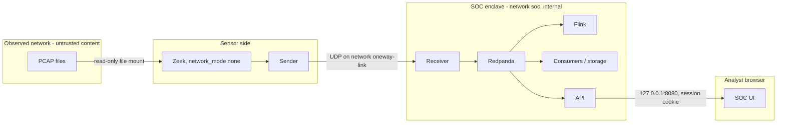
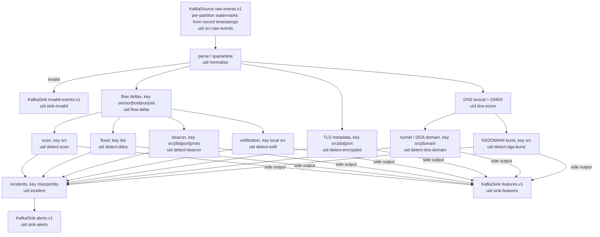
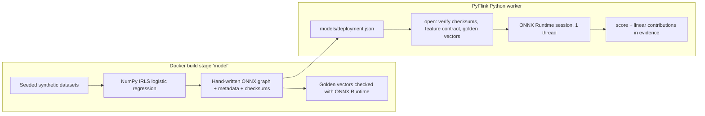

# Architecture

Status: implemented in code (Python + PyFlink). `docs/status.md` records what has been verified and
where. A component described here counts as delivered only once status.md shows evidence for it.

User decisions shaping this document (2026-09-11): all project code is Python (no Java modules). The
detection job therefore uses Flink's Python DataStream API (PyFlink) on the official Flink runtime. All
builds and runs go through Docker on a separate server.

## 1. Executive data flow

In one sentence: Zeek, or the clearly labelled synthetic generator, produces JSON records that cross a simulated one-way link. A receiver validates them and publishes them to Redpanda. A PyFlink job computes bounded keyed features, rules and local ONNX scores, and independent consumers persist, index, notify and display the resulting incident updates.

## 2. Components

| Component | Implementation | Path | Role |
|---|---|---|---|
| Fixture PCAP builder | Python, hand-built frames | `data-generator/sih_datagen/{packets,scenarios,pcap}.py` | Deterministic PCAP scenarios with ground-truth manifests. Writes files only and never transmits. |
| Synthetic log generator | Python | `data-generator/sih_datagen/synthetic.py` | Zeek-format JSON logs (`capture_mode=synthetic_log`), batch or live with rotation, open-loop rate. |
| Zeek sensor | `zeek/zeek:8.0.10` | `sensor/zeek/` | `zeek -C -r` on mounted PCAPs with `network_mode: none`. JSON `conn`, `dns`, `ssl`, `weird` and bounded `flow_update` snapshots. |
| Sender | Python | `ingest/sender/sih_sender/` | Rotation-safe tailing or paced replay, persistent sequence and offsets, HMAC link frames, outward-only UDP. Health leaves only as frames. |
| Receiver | Python | `ingest/receiver/sih_receiver/` | HMAC check, bounded reassembly, persisted dedup and gap window, schema and cross-field validation, durable bounded spool, idempotent `acks=all` publishing. Kafka record timestamp = observation time. |
| Redpanda | `redpandadata/redpanda:v25.3.17` | `infra/redpanda/` | Topics from `docs/contracts.md`, created by `redpanda-init`. Auto-creation disabled. |
| Detection job | PyFlink 2.2.1 on `flink:2.2.1-scala_2.12-java17` | `flink/sih_detect/` | Parse, flow deltas, six detector families, ONNX DGA scoring, incident correlation. Kafka in, Kafka out only. |
| Job supervisor | Python | `flink/sih_detect/supervisor.py` | Submits the job when none is active, restoring from the newest retained checkpoint. Prunes old checkpoint directories. |
| Model training | Python/NumPy | `model-training/sih_ml/` | Deterministic DGA logistic model, hand-written ONNX graph, golden vectors, evaluation. Runs in the Docker build. |
| Consumers | Python | `consumers/sih_consumers/` | One pipeline per container and consumer group. Offsets commit only after the durable write. |
| Archive exporter | Python | `consumers/sih_consumers/archive.py` | Exports closed partitions to object-locked MinIO, verifies them by read-back, then allows retention. |
| API + SOC UI | FastAPI + React/TypeScript (esbuild) | `backend/sih_api/`, `dashboard-security/` | Sessions and roles, REST history from ClickHouse, SSE from its own consumer group. |
| Platform monitoring | Prometheus v3.13.3, Grafana 12.4.10 | `infra/prometheus/`, `infra/grafana/`, `dashboard-platform/` | Scrapes SOC components only. |

Shared code lives in `lib/sih_common/`: identifiers, timestamps, link frame codec, contracts validator, DGA lexical features, ClickHouse HTTP client, config and logging.

## 3. Trust boundaries

- Zeek has no network at all. The sender joins only `oneway-link`, has no listening socket, never reads its UDP socket and cannot reach the SOC network.
- The receiver joins `oneway-link` and `soc` and never transmits toward the sender. Docker networking models the semantics of a data diode, not physical enforcement.
- `soc` and `oneway-link` are `internal: true`. Only the API, Grafana, Prometheus and the Flink UI join an `edge` network, and they publish on 127.0.0.1 only.
- All event content is treated as untrusted. It is length-limited at validation, never executed, returned as JSON data and rendered as text by React under a strict CSP.

## 4. Event and time model

| Field | Set by | Meaning |
|---|---|---|
| `event_time` | Zeek `ts` (decimal, rounded half-up to µs) | Original capture time. |
| `replay_time_offset_us` | Sender, constant per replay run | Maps capture time onto wall clock for the run. |
| observation time | `event_time + offset` (+ `duration_s` for terminal `conn`) | Flink event time. Used as the Kafka record timestamp and for ClickHouse `observation_time`. |
| `sensor_emitted_at` | Sender | Envelope creation wall clock. |
| `receiver_received_at` | Receiver | Datagram arrival wall clock. Latency start point. |

Replay order follows the time a live sensor would have emitted each record (conn = start + duration), so watermarks stay monotonic per partition. A replay speed above 1 compresses only wall-clock pacing; windows and rates are defined in observation time.

## 5. Detection job topology

- Detectors evaluate on every record against running bucket counters. An alert therefore fires as soon as the evidence is sufficient, and does not wait for a window to close. Event-time timers handle only expiry, baselines and incident resolution.
- Every keyed collection has a cap, an event-time expiry and an overflow metric. Capped values are flagged as lower bounds (`capped`). Limits are listed in `docs/feature-catalog.md`.
- Delivery: aligned `EXACTLY_ONCE` checkpoints every 10 s for state consistency. Sinks are `AT_LEAST_ONCE`, and consumers deduplicate on deterministic IDs.
- Detector logic is plain Python over Flink-shaped state objects. `sih_detect.harness` runs the same classes in memory for unit tests.

## 6. ML placement

Feature extraction is one module (`lib/sih_common/dga_features.py`) shared by training and runtime. Only DGA has a learned model. The other six classes are rules/statistics-only (`models/*/README.md`). Any model problem leaves DNS detection rules-only, with a metric and log reason.

## 7. Recovery design

- TaskManager loss: Flink's exponential-delay restart strategy restores the job from the latest completed checkpoint.
- JobManager loss or full Compose restart: the session cluster has no HA store. The supervisor sees no active `sih-detection` job and submits it with `-s <newest complete checkpoint>` found in MinIO. A checkpoint is complete once its `_metadata` exists. If checkpoint storage is unreachable, it waits rather than starting fresh silently.
- Receiver and sender state live in named volumes. Sequences and offsets are persisted atomically.
- `docker compose down` keeps volumes. No routine script uses `down -v`.

## 8. Storage

ClickHouse `sih` database (`infra/clickhouse/migrations/001_init.sql`): `raw_events`, `features`, `alert_updates` (append-only), `incidents_latest` (ReplacingMergeTree on `update_seq`, filled by a materialized view), `invalid_events`, `sensor_health`, `consumer_quarantine` and `archive_manifest`. All are partitioned by ingest day, with no TTL. Least-privilege users: `sih_writer` (consumers), `sih_reader` (API, read-only profile) and `sih_admin` (migrations, archive/retention). MinIO holds `flink-checkpoints` (Flink user only) and `archive` (object lock, archive user only).

## 9. Dashboards and observability

- The SOC UI shows the live stream, severity totals, alert rate, detection and API-visible latency percentiles, threat and confidence distributions, and incident detail with evidence, features, versions, visibility, timeline and related raw events. Uncalibrated and unavailable values are labelled.
- Grafana shows only platform health. Metrics avoid per-IP or per-alert labels. Inference latency is exported as cumulative bucket counters, so percentiles aggregate correctly across workers.

## 10. Deployment and hardening

See `docs/deployment.md`. In summary: pinned images, non-root users, dropped capabilities and `no-new-privileges`, read-only root filesystems for application containers, file-mounted secrets from `scripts/provision-secrets.sh`, localhost-only published ports, and an offline two-stage bundle.
